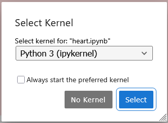
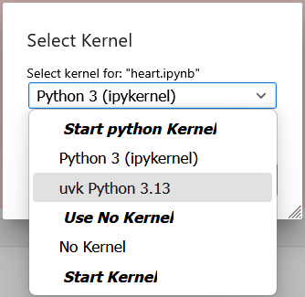

<style>
  span.uvk {
    font-family: sans-serif;
  }
</style>


# How to author a notebook to make is the easiest possible to share

[One](../index.md#why-use-this) of the design objectives of <span class="uvk">uvk</span>
is to make notebooks easier to share with collaborators enabling them to be
*self-contained*.
Under reasonable circumstances,
such notebooks could be published e-mailed to people or published all by themselves
(as [Github Gists](https://gist.github.com/), for instance),
then be open in a reader's Jupyter instance and run without any preparation ritual,
nor fear that the notebook might affect one's own computing space.

!!! tip "Summary of best practices"
    1. Have a <span class="uvk">uvk</span> kernel named `uvk`.
    1. Use the [`%require_python`](../reference/uvk_ext.md#uvk.require_python) and [`%%dependencies`](../reference/uvk_ext.md#uvk.dependencies) magics (from the <span class="uvk">uvk</span> IPython extension) to set up the computing environment.
    1. Document clearly data downloads, where they are stored, and how they can be deleted after the notebook is done.

    Read below for full details.

## <span class="uvk">uvk</span> kernel installation convention

A Jupyter notebook contains [metadata](https://nbformat.readthedocs.io/en/latest/format_description.html#notebook-metadata)
that the Jupyter instances uses to determine what kernel to start when the notebook is open.
The most critical aspect of this metadata is the **kernel name**.
Most notebooks are authored using the default Python kernel that is part of every Jupyter setup
(its name is *python3*).

By [default](../install.md), the name of the <span class="uvk">uvk</span> kernel is,
unsurprisingly, **uvk**.
When a new notebook is created by clicking its icon,
this new notebook gets associated to a kernel named `uvk`.
If someone gets crafty and changes the name of their kernel at install time,
as in

```sh
uvk --name fancy-uvk --user
```

then new notebooks created with its icon get associated with kernel `fancy-uvk`.
It is reasonable to expect readers of a <span class="uvk">uvk</span>-based notebook
to install their own kernel named `uvk`.
However, an author should not expect their audience to track any whimsical
kernel-naming quirk of theirs.
Not changing the default name of the <span class="uvk">uvk</span> minimizes
the surprises on the reader's end.

Remark the the *name* of the kernel is not the same as its *display name*.
The latter is the label displayed under the kernel's icon in the Jupyter Launcher window,
as well as on the top-right of the notebook editor in both Jupyter Lab and Jupyter Notebook.
It is set through the `--display-name` argument to the `uvk` executable,
as in this example:

```sh
uvk --user --display-name 'I ❤️ uvk'
```

If the (not display) name of the kernel tied to the notebook is the same,
non-default display names don't affect the outcome.
Even though the notebook also copies the display name of the associated kernel,
the display name of the kernel shown by Jupyter is that stored in the local kernel spec
of the same (not dipslay) name.

!!! warning "What happens if I share a notebook with a nonstandard name?"
    Upon opening a notebook associated to a kernel they do not have,
    the reader is prompted by Jupyter to choose another one.

    

    When opening the drop-down menu, the user then sees that they _do_ have a
    <span class="uvk">uvk</span> kernel!

    

    Why would they have to choose it now? 
    It is confusing.
    And it is due simply from the kernel's name not being the same as that of their
    own <span class="uvk">uvk</span> kernel.
    Thus, amusingly, the tip above is equally useful for sharing notebooks as it is
    for reading notebooks shared by others.

## Build the computing environment...

The downside of <span class="uvk">uvk</span> providing a clean isolated Python
environment on the fly is that this environment is nearly bare at the moment
the kernel starts.
The computations expressed in the notebook may rely on Python syntax or standard
library packages that are only available in some versions of the Python distribution.
Furthermore,
the author may be relying on a panoply of external packages.
The <span class="uvk">uvk</span> IPython extension provides facilities to
fulfill both these goals.
Load this extension with

```ipython
%load_ext uvk
```

### Constrain the Python distribution

The reader who will run a notebook shared by somebody else has to provide a suitable
Python distribution.
The author will manifest their constraints with the [`%require_python`](../reference/uvk_ext.md#uvk.require_python)
line magic.
When this line magic is run,
it raises an exception if the Python interpreter's version does not satisfy
the constraint,
stopping a notebook execution ahead of, presumably,
version-specific computational idioms.
For instance,
if the author runs Python 3.13 and wants to be absolutely certain that their
syntax and package usage
(for instance, they use the [`copy.replace`](https://docs.python.org/3.13/library/copy.html#copy.replace)
function)
don't raise issue when run by their audience:

```ipython
%require_python >=3.13
```

Or, if the notebook documents a very specific interpreter bug in, says, Python 3.11.8:

```ipython
%require_python ==3.11.8
```

Remark that using this cell is not necessary per se.
Very little Python code breaks between Python versions,
or is as specific as the last contrived example.
It does, however, document expectations usefully for readers that may
encounter problems.

### Gather external package dependencies

The set of external packages the notebook's computations depend on are most elegantly captured
using the [`%%dependencies`](../reference/uvk_ext.md#uvk.dependencies) cell magic.
Here is an example pulling in Matplotlib, Requests, Pandas and Scikit-Learn:

```ipython
%%dependencies
matplotlib
pandas
requests
scikit-learn
```

It is possible to specify versions for these packages.
Besides, for reproducibility purposes, it may even be the better practice.

```ipython
%%dependencies
matplotlib==3.10.8
pandas==3.0.2
requests==2.33.1
scikit-learn==1.8.0
```

!!! note "Dependency fixed- or upper-bounding is **fine** with <span class='uvk'>uvk</span>"
    In the package development community, there is a lot of discourse that takes a dim view of
    [package bounding](https://iscinumpy.dev/post/bound-version-constraints/)
    below or at a fixed version.
    However, <span class="uvk">uvk</span> provides a _dedicated_ environment for your notebook,
    so none of the common bounding practices apply.
    Being specify on the dependencies maximizes one's chances that their notebook will be
    runnable by their audience, even years beyond the moment of publication.

!!! attention "Constraint syntax is more restricted than PyPA specification"
    The Python Package Authority specifies a rather loose [syntax](https://pip.pypa.io/en/stable/reference/requirement-specifiers/)
    for package requirements.
    For implementation simplicity, <span class="uvk">uvk</span> relies on largely the
    same package-extra-bounds system,
    but **forbids blanks between package name, optional extra specifications, and version bound**.
    Thus,

    <pre>
    <code class="hljs language-python">matplotlib==3.10.8
    marimo[sql]<0.23
    </code></pre>

    are **valid** ✅; however

    <pre>
    <code class="hljs language-python">matplotlib == 3.10.8
    marimo [sql] <.23
    </code></pre>

    are **invalid** 🚫.

Under the hood, `%%dependencies` invokes `uv pip install`,
a faster implementation of trusty old `pip install` that leverages uv's
super efficient caching tricks.
It thus provides both good documentation of computational requirements
and implements their deployment at the best speed affordable.

Remark that, while it is possible to use the `%%dependencies` cell more than once in a notebook,
it is not advised to do so.
Dependency network resolution works best,
and is most reproducible as well,
when all constraints are considered simultaneously.

## ... then avoid spilling out of it

uv and <span class="uvk">uvk</span> provide an isolated computing environment with respect to
package dependencies.
However, the <span class="uvk">uvk</span> kernel is not a Docker container.
Once it restarts, its virtual environment goes away,
but every other aspects of the user's computing environment &mdash; mainly
persistent storage, as well as further workstation administration aspects &mdash;
remains as the computation modified it.

For simplicity's sake, the main computation that would impact a reader's environment would
be the storage of ad hoc files,
either downloaded as input to downstream computations,
or produced through the execution of the notebook.
In both cases,
the careful author will document precisely where data gets stored,
and if possible,
how much data will be downloaded or stored.
It is also excellent style to provide a commented-out code cell that would
clean up the data stored by the notebook,
returning the user's computer to the state the notebook found it in.
